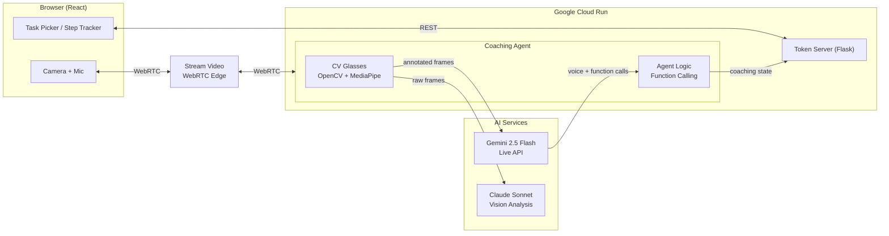

# GuideSight

**Live app: https://guidesight.vercel.app**

**Real-time AI coach that sees through your camera and talks you through physical tasks — like having an expert instructor looking over your shoulder.**

No buttons, no turn-taking. Continuous bidirectional video and voice powered by Gemini 2.5 Flash Live API.

> **"Gemini can reason but can't measure. Our CV layer measures, Gemini reasons."**

## How It Works

GuideSight combines Google's Gemini 2.5 Flash (real-time video + audio streaming) with a computer vision preprocessing layer we call **"CV Glasses"**. Raw camera frames pass through OpenCV paper detection and MediaPipe hand tracking *before* Gemini sees them. The AI reasons about annotated frames — bounding boxes, orientation labels, hand skeletons — instead of raw pixels. This eliminates spatial hallucinations and gives Gemini reliable grounding.

```
Raw Camera Frame → OpenCV (paper contour, orientation) → MediaPipe (hand skeleton, pinch detection) → Annotated Frame → Gemini reasons + coaches via voice
```

The user just talks and works. The AI watches, catches mistakes mid-action, confirms progress, and advances through structured task steps — all through natural conversation.

## Architecture



See [`architecture.md`](architecture.md) for the full detailed diagram with data flows.

## Tech Stack

| Layer | Technology | Purpose |
|---|---|---|
| **AI Engine** | Gemini 2.5 Flash via Live API (`google-genai` SDK) | Real-time bidirectional video + audio coaching |
| **CV Glasses** | OpenCV + MediaPipe | Paper detection, orientation labeling, hand tracking, pinch detection |
| **Vision Analysis** | Claude Sonnet (Anthropic) | Periodic spatial analysis, step verification, regression detection |
| **Transport** | Stream Video SDK (`@stream-io/video-react-sdk`) | WebRTC for camera/mic/audio between browser and agent |
| **Frontend** | React 19 + TypeScript + Vite + Tailwind CSS v4 | Task picker, coaching session, admin dashboard |
| **Token Server** | Flask (Python) | Stream tokens, task CRUD API, AI task generation |
| **Deployment** | Google Cloud Run (3 services) | Token server, coaching agent, frontend |
| **Task Storage** | JSON files on disk | No database needed |

## Features

- **Real-time vision coaching**: AI sees your camera at 1fps, speaks guidance via native TTS
- **CV "Glasses" pipeline**: OpenCV detects paper orientation + fold lines, MediaPipe tracks hands — annotations drawn on frames before Gemini sees them
- **Natural conversation**: Barge-in support, no turn-taking, continuous bidirectional audio
- **Structured task steps**: Step tracker with visual confirmation before advancing
- **AI task generation**: Upload a video or describe a task — Gemini generates the full task JSON with steps, visual cues, and error detection
- **AI task editing**: Natural language chat to modify tasks (add steps, change instructions, etc.)
- **Error detection**: AI catches mistakes mid-action and interrupts with corrections
- **Step regression**: Detects when users undo work and adjusts step tracking accordingly
- **Session resumption**: Automatic Gemini session reconnection (handles 2-min video limit)
- **Admin dashboard**: Full CRUD for tasks at `#admin`

## Prerequisites

- **Python 3.11+**
- **Node.js 20+**
- **API Keys**:
  - `GOOGLE_API_KEY` — [Google AI Studio](https://aistudio.google.com/)
  - `STREAM_API_KEY` + `STREAM_API_SECRET` — [Stream](https://getstream.io/)
  - `ANTHROPIC_API_KEY` — [Anthropic](https://console.anthropic.com/)
  - `SHISA_API_KEY` (optional) — For Japanese translation

## Quick Start (Local)

```bash
# 1. Clone and setup
git clone https://github.com/Gentle-mann/guidesight.git
cd guidesight
cp .env.example .env
# Edit .env with your API keys

# 2. Python environment
python3 -m venv venv
source venv/bin/activate
pip install -r requirements.txt

# 3. Start token server (Terminal 1)
cd server && python token_server.py
# → http://localhost:8080

# 4. Start coaching agent (Terminal 2)
source venv/bin/activate
cd server && python agent.py
# → Polls for task selection, then joins Stream call

# 5. Start frontend (Terminal 3)
cd client
npm install
npm run dev
# → http://localhost:5173
```

**Startup order matters**: Token server first → Agent second → Frontend last.

## Cloud Deployment (Google Cloud Run)

### Prerequisites
- [Google Cloud CLI](https://cloud.google.com/sdk/docs/install) installed and authenticated
- Docker installed
- A GCP project with billing enabled

### One-Command Deploy

```bash
# Deploy all 3 services to Cloud Run
./deploy.sh YOUR_GCP_PROJECT_ID us-central1
```

This script (included in the repo for reproducibility):
1. Creates an Artifact Registry repository
2. Builds and pushes 3 Docker images (token server, agent, frontend)
3. Deploys token server to Cloud Run
4. Deploys agent to Cloud Run (always-on CPU, min 1 instance)
5. Builds frontend with the token server URL baked in
6. Deploys frontend to Cloud Run
7. Prints all service URLs

### Docker Images

| Service | Dockerfile | Size | Notes |
|---|---|---|---|
| Token Server | `Dockerfile.token-server` | ~330 MB | Flask, lightweight |
| Coaching Agent | `Dockerfile.agent` | ~606 MB | OpenCV, MediaPipe, vision_agents |
| Frontend | `Dockerfile.frontend` | ~94 MB | Multi-stage Node build → nginx |

### Environment Variables

Set via `--set-env-vars` in Cloud Run (handled by `deploy.sh`):

| Variable | Service | Required |
|---|---|---|
| `GOOGLE_API_KEY` | Token server, Agent | Yes |
| `STREAM_API_KEY` | Token server, Agent | Yes |
| `STREAM_API_SECRET` | Token server, Agent | Yes |
| `ANTHROPIC_API_KEY` | Agent | Yes |
| `TOKEN_SERVER` | Agent | Yes (Cloud Run URL of token server) |
| `VITE_TOKEN_SERVER` | Frontend (build-time) | Yes (Cloud Run URL of token server) |
| `SHISA_API_KEY` | Token server | No (translation feature) |

## Task JSON Schema

Tasks are defined as JSON files in `server/tasks/`. Each task describes the steps an AI coach should guide a user through:

```json
{
  "id": "paper_airplane",
  "name": "Paper Dart Airplane",
  "description": "Classic paper dart airplane",
  "difficulty": "beginner",
  "estimated_time": "5 minutes",
  "components": ["1x A4 paper"],
  "cv_tools": ["paper_detection", "hand_tracking", "edge_detection"],
  "steps": [
    {
      "step": 1,
      "instruction": "Place the paper in portrait orientation",
      "visual_cue": "Paper is taller than wide, long edge vertical",
      "common_errors": ["Paper in landscape", "Paper at an angle"]
    }
  ]
}
```

New tasks can be created via the admin dashboard (`#admin`) or generated by AI from uploaded videos/descriptions.

## Project Structure

```
guidesight/
├── server/
│   ├── token_server.py          # Flask API — tokens, task CRUD, AI generation
│   ├── agent.py                 # Gemini coaching agent — joins Stream call
│   ├── agent_server.py          # HTTP wrapper for Cloud Run deployment
│   ├── paper_detector.py        # OpenCV paper detection processor
│   ├── hand_tracker.py          # MediaPipe hand tracking annotator
│   ├── claude_vision.py         # Claude periodic vision analysis loop
│   ├── prompts/task_coach.md    # System prompt template
│   └── tasks/*.json             # Task definitions
├── client/
│   └── src/
│       ├── App.tsx              # Main app flow
│       └── components/          # TaskPicker, CoachingSession, StepTracker, Admin
├── Dockerfile.token-server
├── Dockerfile.agent
├── Dockerfile.frontend
├── deploy.sh                    # One-command Cloud Run deployment
├── architecture.md              # Detailed architecture diagrams
├── requirements.txt             # Python dependencies
└── .env.example                 # API key template
```

## Third-Party Disclosures

| Library | Author | Purpose | License |
|---|---|---|---|
| [vision_agents](https://github.com/GetStream/Vision-Agents) | GetStream | Orchestration layer wrapping Gemini Realtime + WebRTC | MIT |
| [Stream Video SDK](https://getstream.io/video/) | GetStream | WebRTC transport (TURN/STUN, edge network) | Commercial |
| [google-genai](https://github.com/googleapis/python-genai) | Google | Gemini API SDK (Live API, content generation) | Apache 2.0 |
| [OpenCV](https://opencv.org/) | OpenCV team | Paper detection, contour analysis, frame annotation | Apache 2.0 |
| [MediaPipe](https://developers.google.com/mediapipe) | Google | Hand landmark detection (21 points/hand) | Apache 2.0 |
| [Anthropic SDK](https://github.com/anthropics/anthropic-sdk-python) | Anthropic | Claude vision API for spatial analysis | MIT |

## License

MIT
