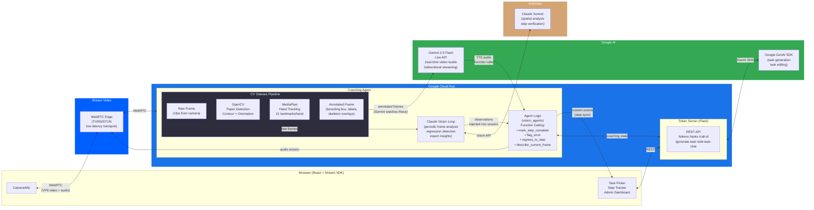
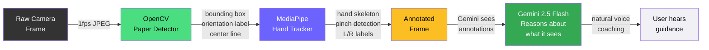

# GuideSight — Architecture

## System Architecture (Mermaid)



## Core Innovation: CV "Glasses" Pipeline



> **"Gemini can reason but can't measure. Our CV layer measures, Gemini reasons."**

## Excalidraw / Draw.io Layout Guide

Use this as a reference to create the polished visual diagram for the demo video and Devpost submission.

### Layout (Left to Right, 4 columns)

```
COLUMN 1: USER          COLUMN 2: TRANSPORT       COLUMN 3: CLOUD RUN           COLUMN 4: AI SERVICES
─────────────────       ──────────────────        ───────────────────────        ─────────────────────

┌─────────────┐         ┌──────────────┐          ┌───────────────────────┐      ┌─────────────────┐
│  📱 Browser │ ◄─────► │  Stream      │ ◄──────► │  🤖 Coaching Agent    │ ◄──► │  Gemini 2.5     │
│             │  WebRTC │  Video Edge  │  WebRTC  │                       │ Live │  Flash          │
│  Camera     │  (VP8)  │  (TURN/STUN) │          │  ┌─────────────────┐  │ API  │  (video+audio   │
│  Mic        │         └──────────────┘          │  │ CV "Glasses"    │  │      │   streaming)    │
│  Speaker    │                                   │  │                 │  │      └─────────────────┘
│             │         ┌──────────────┐          │  │ 📄 OpenCV       │  │
│  React App  │ ◄─────► │  Token       │          │  │  Paper detect   │  │      ┌─────────────────┐
│  TaskPicker │  REST   │  Server      │          │  │  Orientation    │  │      │  Claude Sonnet  │
│  StepTrack  │         │  (Flask)     │          │  │                 │  │ ◄──► │  (spatial        │
│  Admin      │         │              │          │  │ 🖐 MediaPipe    │  │      │   analysis,     │
│             │         │  Task CRUD   │          │  │  Hand skeleton  │  │      │   verification) │
└─────────────┘         │  Tokens      │          │  │  Pinch detect   │  │      └─────────────────┘
                        │  AI Generate │          │  └─────────────────┘  │
                        └──────────────┘          │                       │      ┌─────────────────┐
                                                  │  Agent Logic          │      │  Google GenAI   │
                              ☁️ Google Cloud Run  │  • Function calling   │      │  SDK            │
                                                  │  • Step management    │ ◄──► │  (task gen,     │
                                                  │  • Session resumption │      │   task edit)    │
                                                  └───────────────────────┘      └─────────────────┘
```

### Key Visual Elements for the Polished Version

1. **Highlight the CV pipeline** with a colored box or dashed border — this is the differentiator
2. **Show the frame transformation**: Raw frame (blurry photo) → Annotated frame (with green box, "PORTRAIT" label, hand skeleton) → Gemini icon
3. **Use Google Cloud logo** on the Cloud Run box
4. **Use tech logos**: React, Gemini, Stream, OpenCV, MediaPipe
5. **Color coding**:
   - Blue (#1a73e8): Google Cloud services
   - Green (#34a853): Gemini / Google AI
   - Purple (#6c63ff): GuideSight's CV layer (the unique part)
   - Orange: Stream Video transport
6. **Arrow labels** should be concise: "WebRTC (VP8)", "Live API", "REST", "Vision API"
7. **Call out the data flow** with numbered steps if space allows:
   - ① Camera captures frame
   - ② Stream delivers via WebRTC
   - ③ CV "Glasses" annotate the frame
   - ④ Gemini sees annotated frame + reasons
   - ⑤ Gemini speaks coaching back to user
